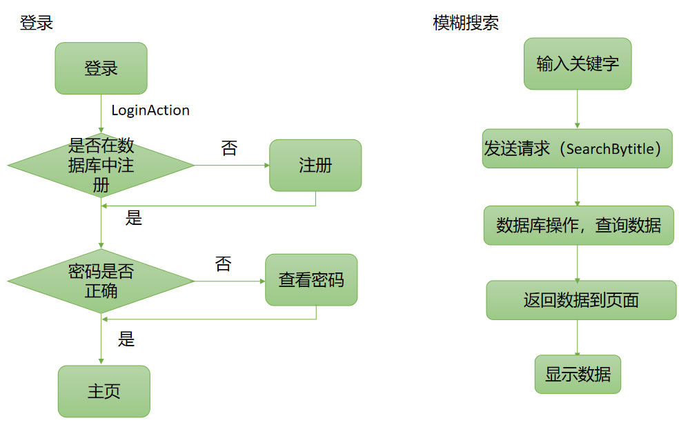
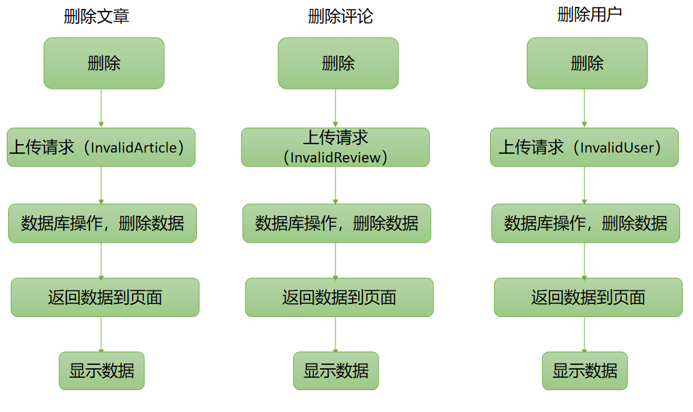
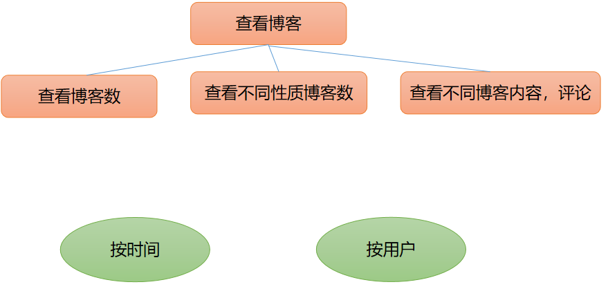

## 一、commit记录

1.All html pages finished  
将博客系统所有的网页布局写好  
2.logo3  
修改项目的logo  
3.ADD reg  
增加注册页面  
4.logo and html revised  
修改部分html页面  
5.reg function finished  
完成注册功能，即数据的写入功能  
6.ADD bokeindex.html  
将博客首页添加到public文件夹  
7.login function finished  
完成登陆功能  
8.forgetpassword function finished  
忘记密码功能完成  
9.ADD forgetPwd.html  
将修改密码界面添加到public文件夹  
10.editpassword function finished  
修改密码功能完成  
11.ADD userInfo.html  
将用户信息界面添加到public文件夹  
12.ADD Reviseinfo.html  
将修改用户信息届买年添加到public文件夹  
13.Revise private info function finished  
修改用户信息功能完成  
14.ADD Mymanagement.html  
将发表文章界面添加到public文件夹  
15.publish passages funciton finished  
发表文章功能完成  
16.ADD Myarticle.html  
将查看个人文章界面添加到public文件夹  
17.view private passages function finished  
查看个人文章功能完成   
18.ADD Articledetail  
添加Articledetail文件夹  
19.view all passages and order function finished  
查看所有人的文章和按作者、时间排序功能完成   
20.view the number of my passages function finished  
查看自己文章个数，原创个数、摘抄个数功能完成  
21.Delete passages function finished  
删除文章功能成功  
22.Revise passages function finished  
修改文章功能成功  
23.review function finished  
创建reviewdatas数据库，添加数据库，查询数据库功能完成，同时删除Articledetail文件夹  
24.ADD MyAllReview.html  
添加MyAllReview.html到public文件  
25.ADD Revisereview.html  
添加Revisereview.html到public文件  
26.revise and delete review function finished  
修改删除评论功能完成  
27.common user function finished  
普通用户功能完成  
--------------common user 界面功能完成------------------------------------  
28.ADD adbokeindex.html  
添加管理员博客首页界面到admin文件夹  
29.ADD adMymanagement.html  
添加管理员管理界面到admin文件夹    
30.ADD adarticledetail.html
添加管理员文章详情界面到admin文件夹  
31.admin bokeindex function finished  
完成管理员博客首页界面，完成排序、搜索文章等功能
32.admin view passages and delete passages function finished  
完成管理员查看文章和删除文章功能  
33.ADD adAllReview.html  
添加管理员评论详情界面到admin文件夹    
33.delete all review function finished  
完成管理员删除文章功能  
34.ADD adAllauthor.html  
添加管理员用户界面到admin文件夹   
35.admin view and delete common user function fineshed  
添加管理员用户详情界面到admin文件夹，完成管理员查看和删除普通用户功能  
--------------admin 界面功能完成------------------------------------  
36.improve the functions  
校验功能           

## 二、系统介绍

### 1.系统简介

月亮博客信息管理系统是互联网平台上的信息交流中心。通常博客就是用来发表文章，文章按照发表时间排列。
每位用户零成本、零维护地创建自己的网络媒体，每个人都可以随时把自己的思想火花和灵感更新到月亮博客上。月亮博客管理系统分为普通用户和管理员，其功能如下：

|          | 功能                                                         |
| -------- | ------------------------------------------------------------ |
| 普通用户 | 1.可以查看其他用户的博客，进行评论 2.查看、删除、修改自己的文章   3.查看、删除、修改自己的评论  4.查看、修改个人信息、密码 |
| 管理员   | 1.查看、删除所有用户的文章   2.查看、删除所有用户的评论  3.查看、删除普通用户 |

### 2.业务流程

（1）总体流程

（2）具体流程

（3）数据设计

userdatas表

| 字段名称 | 数据类型 | 是否主键 | 中文说明 | 备注                       |
| -------- | -------- | -------- | -------- | -------------------------- |
| id       | int      | 是       | 序列号   | 系统自动生成               |
| username | String   |          | 用户名   |                            |
| password | String   |          | 密码     |                            |
| sex      | String   |          | 性别     |                            |
| birth    | String   |          | 生日     |                            |
| major    | String   |          | 专业     |                            |
| talent   | String   |          | 才能     |                            |
| identity | String   |          | 身份     | 判断是否为管理员、普通用户 |

articledatas表

| 字段名称  | 数据类型 | 是否主键 | 中文说明     | 备注         |
| --------- | -------- | -------- | ------------ | ------------ |
| id        | int      | 是       | 序列号       | 系统自动生成 |
| title     | String   |          | 文章名称     |              |
| property  | String   |          | 文章属性     |              |
| content   | String   |          | 文章内容     |              |
| time      | String   |          | 文章发表时间 |              |
| author    | String   |          | 文章作者     |              |
| readcount | String   |          | 文章阅读次数 |              |

reviewdatas

| 字段名称         | 数据类型 | 是否主键 | 中文说明     | 备注         |
| ---------------- | -------- | -------- | ------------ | ------------ |
| id               | int      | 是       | 序列号       | 系统自动生成 |
| review_articleId | String   |          | 评论文章id号 |              |
| review_author    | String   |          | 评论人员姓名 |              |
| review_content   | String   |          | 评论内容     |              |
| review_time      | String   |          | 评论时间     |              |
|                  |          |          |              |              |

### 3.功能展示

