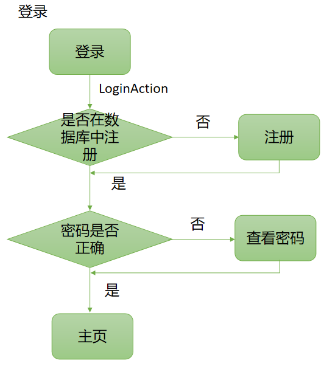
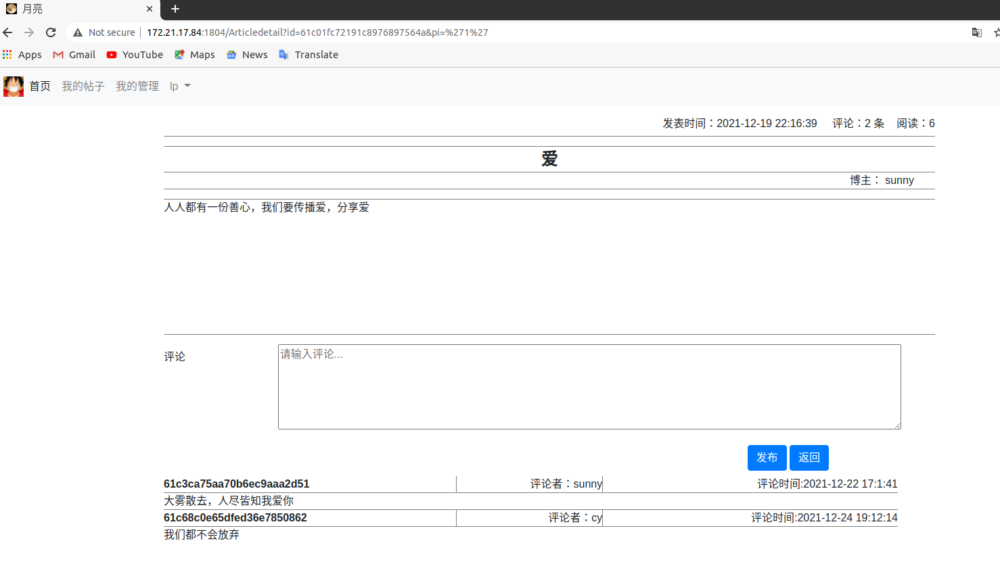

*本系统为原创*

## 一、项目设计

### 1.系统简介

月亮博客信息管理系统是互联网平台上的信息交流中心。通常博客就是用来发表文章，文章按照发表时间排列。
每位用户零成本、零维护地创建自己的网络媒体，每个人都可以随时把自己的思想火花和灵感更新到月亮博客上。月亮博客管理系统分为普通用户和管理员，其功能如下：

|          | 功能                                                         |
| -------- | ------------------------------------------------------------ |
| 普通用户 | 1.可以查看其他用户的博客，进行评论 2.查看、删除、修改自己的文章   3.查看、删除、修改自己的评论  4.查看、修改个人信息、密码 |
| 管理员   | 1.查看、删除所有用户的文章   2.查看、删除所有用户的评论  3.查看、删除普通用户 |

### 2.项目总体构成


### 3.项目引入的包


（1)bootstrap.min.css、boostrap.min.js


是前端框架bootstrap的css和js文件，前端使用bootstrap进行布局。

（2）jquery-3.3.1.slim.min.js、jquery.min.js

是一个简洁而快速的JavaScript库，可用于简化事件处理，HTML文档遍历，Ajax交互和动画，以便快速开发网站。

(3)popper.min.js

用于设置弹窗、提示、下拉菜单,是第三方插件

(4)express

```sh
 npm install express --save
```

基于 Node.js平台，快速、开放、极简的 Web 开发框架

(5)ejs

```bash
npm install ejs
```

EJS 是一套简单的模板语言，利用普通的 JavaScript 代码生成 HTML 页面。EJS 没有如何组织内容的教条；也没有再造一套迭代和控制流语法；有的只是普通的 JavaScript 代码而已。

(6)mongoose

```sh
npm install mongoose
```

Mongoose为模型提供了一种直接的，基于scheme结构去定义你的数据模型。它内置数据验证，查询构建，业务逻辑钩子等。        

### 4.项目目录结构


（1）date.format


日期标准化工具

（2）lib

一些jar


（3）logo


项目logo文件

（4）node_modules


安装node后用来存放用包管理工具下载安装的包的文件夹

(5)public


是所有界面的文件夹

admin包含

| 名称                 | 介绍                   |
| -------------------- | ---------------------- |
| adAllauthor.html     | 管理员查看删除用户界面 |
| adAllReview.html     | 管理员查看删除评论界面 |
| adarticledetail.html | 管理员查看文章详情界面 |
| adbokeindex.html     | 管理员首页             |
| adMymanagement.html  | 管理员查看删除文章界面 |
| aduserInfo.html      | 管理员查看用户信息界面 |

photo包含项目所需要的图片


其余html为普通用户界面


| 名称                        | 介绍             |
| --------------------------- | ---------------- |
| articledetail.html          | 文章详情界面     |
| bokeindex.html              | 博客首页         |
| editPwd.html                | 修改密码界面     |
| forgetPwd.html              | 忘记密码界面     |
| index.html                  | 登陆界面         |
| Modify_delete_articles.html | 修改删除文章界面 |
| MyAllReview.html            | 修改删除评论界面 |
| MyArticle.html              | 我的文章界面     |
| Mymanagement.html           | 发表文章界面     |
| reg.html                    | 注册界面         |
| Revisearticle.html          | 修改文章界面     |
| Revisereview.html           | 修改评论界面     |
| userInfo.html               | 用户信息界面     |

（6）readme.assets


readme.md文档所需要的图片

（7）NodejsMongodbLog.js


后端js进行渲染，实现数据库的增删改查、页面跳转等功能

### 5.数据库设计

userdatas表

| 字段名称 | 数据类型 | 是否主键 | 中文说明 | 备注                       |
| -------- | -------- | -------- | -------- | -------------------------- |
| id       | int      | 是       | 序列号   | 系统自动生成               |
| username | String   |          | 用户名   |                            |
| password | String   |          | 密码     |                            |
| sex      | String   |          | 性别     |                            |
| birth    | String   |          | 生日     |                            |
| major    | String   |          | 专业     |                            |
| talent   | String   |          | 才能     |                            |
| identity | String   |          | 身份     | 判断是否为管理员、普通用户 |

articledatas表

| 字段名称  | 数据类型 | 是否主键 | 中文说明     | 备注         |
| --------- | -------- | -------- | ------------ | ------------ |
| id        | int      | 是       | 序列号       | 系统自动生成 |
| title     | String   |          | 文章名称     |              |
| property  | String   |          | 文章属性     |              |
| content   | String   |          | 文章内容     |              |
| time      | String   |          | 文章发表时间 |              |
| author    | String   |          | 文章作者     |              |
| readcount | String   |          | 文章阅读次数 |              |

reviewdatas

| 字段名称         | 数据类型 | 是否主键 | 中文说明     | 备注         |
| ---------------- | -------- | -------- | ------------ | ------------ |
| id               | int      | 是       | 序列号       | 系统自动生成 |
| review_articleId | String   |          | 评论文章id号 |              |
| review_author    | String   |          | 评论人员姓名 |              |
| review_content   | String   |          | 评论内容     |              |
| review_time      | String   |          | 评论时间     |              |
|                  |          |          |              |              |

### 

## 二、使用说明书

1.登陆、注册、修改密码、查看密码功能



在网页搜索栏上输入网址，进入首页


点击左下角注册账号进入注册账号界面


填写信息，并点击register按钮


注册成功点击返回按钮返回首页，若忘记密码，点击右下角忘记密码，进入忘记密码界面


输入用户名，按find按钮将返回密码，按return按钮返回登陆页面


进入普通用户主页


点击下三角号，点击修改密码，进入修改密码界面：


输入旧的密码需要是原密码，否则更改不成功，点击修改，修改成功后，点击返回


2.发表文章、发表评论功能、查看文章详情、文章阅读量、评论数统计功能


点击任意查看按钮，进入文章详情界面，增加一次阅读


文章详情界面右上角为发表时间、评论条数、阅读量、中间为标题、作者、内容，下方可以发表评论，查看评论



填写评论内容


点击发布，评论内容出现在下方，同时评论数增加


点击我的管理，进入发表文章界面，填写信息，点击发表按钮，发表成功


点击导航栏我的帖子，显示我已经发表的所有帖子


3.查看博客，搜索博客，按时间、按作者、按性质排序功能


点击我的帖子，在输入文章名称里输入文章标题，点击搜索，显示对应文章


点击按性质，将会按文章性质排序


点击按时间，将会以文章发表时间排序


首页功能同理。点击按作者按钮，会按照作者顺序进行排序


4.删除修改文章、评论，删除用户，修改个人信息功能


点击导航栏我的管理，点击左侧修改删除文章，进入以下界面，显示总文章数，原创数目，摘抄数目，点击删除文章，即可删除对应的文章


点击修改文章按钮，进入修改文章界面，填写相关内容，点击修改，即可修改成功


点击左侧修改删除评论，即可删除对应评论


点击修改评论按钮，进入修改评论界面，填写相关内容，点击修改，即可修改成功


点击左侧栏我的信息，进入个人信息界面，通过下三角下的子菜单点击我的信息也可进入个人信息界面。


点击右侧修改个人信息按钮，可以进入修改个人信息界面，进行相关内容的填写，点击修改，修改成功

登陆管理员账号，在我的管理界面下点击所有用户，可以进入如下界面，点击查看详情，可以查看用户详情信息，点击删除用户可以删除此用户。


5.管理员功能

在上个部分已经介绍了删除用户功能，这里不再赘述。

登陆管理员账号，进入管理员首页，可以查看所有人的文章，进行搜索，按作者、时间对文章进行排序


点击我的管理，点击左侧所有文章，可以点击删除文章按钮，删除相应文章


点击左侧所有评论，可以查看评论，并对有关评论进行删除


## 三、commit记录

1.All html pages finished  
将博客系统所有的网页布局写好  
2.logo3  
修改项目的logo  
3.ADD reg  
增加注册页面  
4.logo and html revised  
修改部分html页面  
5.reg function finished  
完成注册功能，即数据的写入功能  
6.ADD bokeindex.html  
将博客首页添加到public文件夹  
7.login function finished  
完成登陆功能  
8.forgetpassword function finished  
忘记密码功能完成  
9.ADD forgetPwd.html  
将修改密码界面添加到public文件夹  
10.editpassword function finished  
修改密码功能完成  
11.ADD userInfo.html  
将用户信息界面添加到public文件夹  
12.ADD Reviseinfo.html  
将修改用户信息届买年添加到public文件夹  
13.Revise private info function finished  
修改用户信息功能完成  
14.ADD Mymanagement.html  
将发表文章界面添加到public文件夹  
15.publish passages funciton finished  
发表文章功能完成  
16.ADD Myarticle.html  
将查看个人文章界面添加到public文件夹  
17.view private passages function finished  
查看个人文章功能完成   
18.ADD Articledetail  
添加Articledetail文件夹  
19.view all passages and order function finished  
查看所有人的文章和按作者、时间排序功能完成   
20.view the number of my passages function finished  
查看自己文章个数，原创个数、摘抄个数功能完成  
21.Delete passages function finished  
删除文章功能成功  
22.Revise passages function finished  
修改文章功能成功  
23.review function finished  
创建reviewdatas数据库，添加数据库，查询数据库功能完成，同时删除Articledetail文件夹  
24.ADD MyAllReview.html  
添加MyAllReview.html到public文件  
25.ADD Revisereview.html  
添加Revisereview.html到public文件  
26.revise and delete review function finished  
修改删除评论功能完成  
27.common user function finished  
普通用户功能完成  
--------------common user 界面功能完成------------------------------------  
28.ADD adbokeindex.html  
添加管理员博客首页界面到admin文件夹  
29.ADD adMymanagement.html  
添加管理员管理界面到admin文件夹    
30.ADD adarticledetail.html
添加管理员文章详情界面到admin文件夹  
31.admin bokeindex function finished  
完成管理员博客首页界面，完成排序、搜索文章等功能
32.admin view passages and delete passages function finished  
完成管理员查看文章和删除文章功能  
33.ADD adAllReview.html  
添加管理员评论详情界面到admin文件夹    
33.delete all review function finished  
完成管理员删除文章功能  
34.ADD adAllauthor.html  
添加管理员用户界面到admin文件夹   
35.admin view and delete common user function fineshed  
添加管理员用户详情界面到admin文件夹，完成管理员查看和删除普通用户功能  
--------------admin 界面功能完成------------------------------------  
36.improve the functions  
校验功能              
37.modify the readme.md   
修改说明文档   
38.finish readme.md  
完成说明文档 
39.improve readme.md
完善说明文档  
